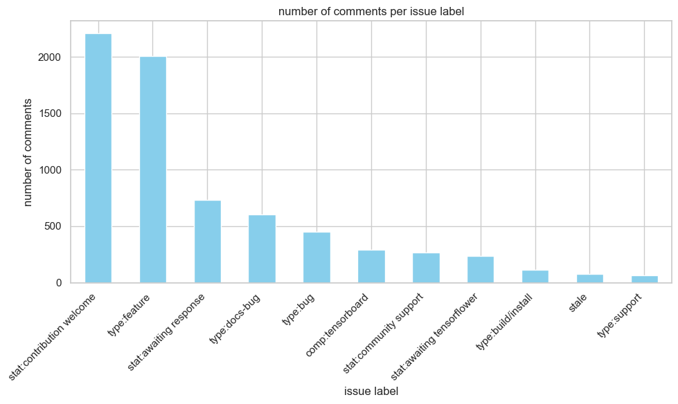
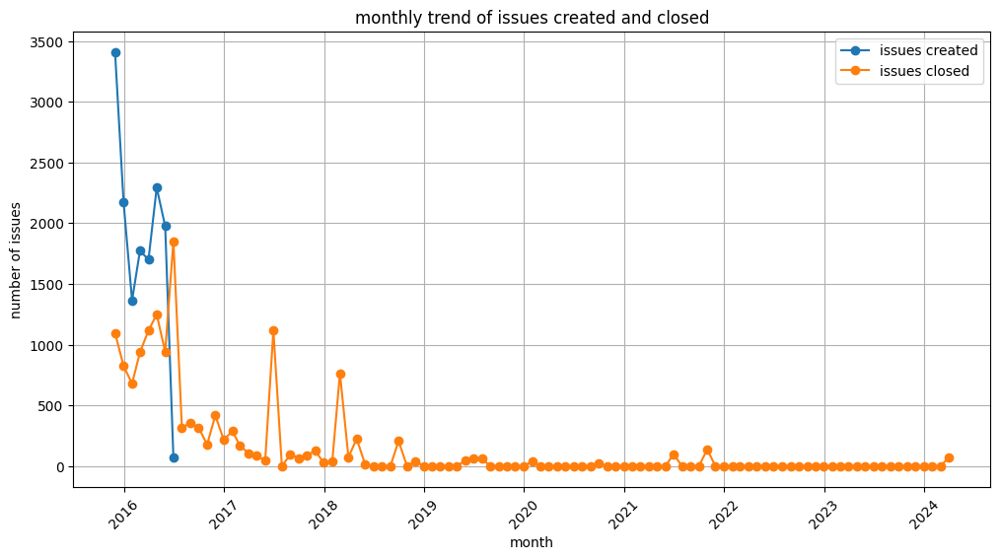
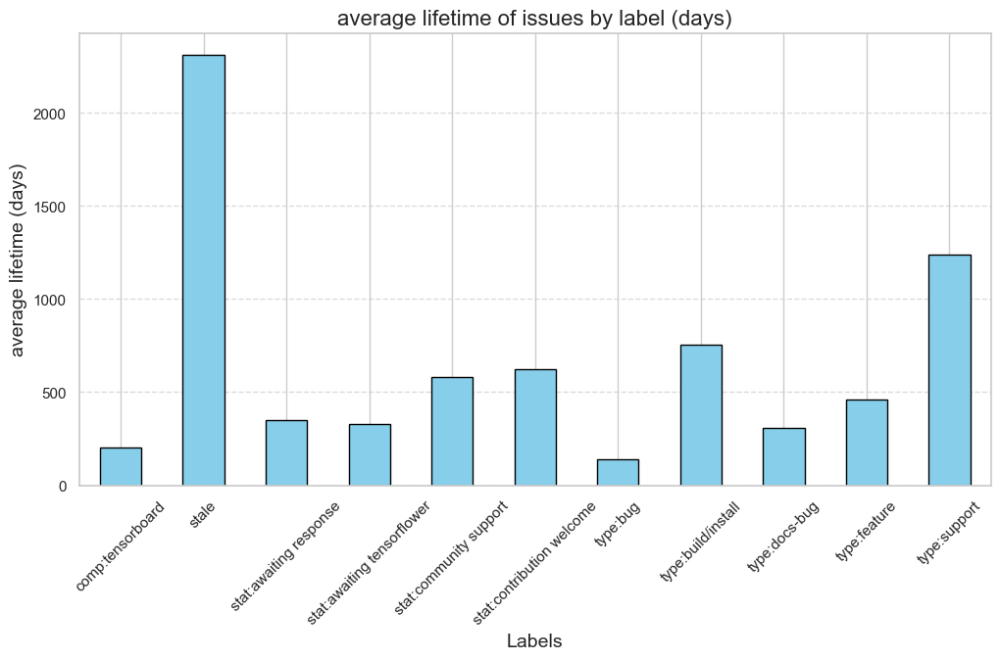

# Python + Github + GraphQL = PyGitGraph

- 
- **Py**thon + **Git**hub + **Graph**QL = **PyGitGraph**
- "PyGitGraph" is a comprehensive suite of Jupyter notebooks for efficiently working with GitHub issues via [GitHub's GraphQL API](https://docs.github.com/en/graphql)
- the code in this repo allows you to **analyze, visualize, and manage your Github issues like a pro!**
- future roadmap involves extending this functionality to PRs, Discussions and other Github functionalities

# blog post on "PyGitGraph"

- I have made a blog post on my website covering PyGitGraph. You can find it [here](https://www.kunal-pathak.com/blog/PyGitGraph/). The blog post looks at the tool in a more non-technical way.
- Alternatively, you can continue reading up more about the tool in the sections below.

# purpose of "PyGitGraph"

- GitHub's Issues feature provides robust project management tools, and its [GraphQL API](https://docs.github.com/en/graphql/overview/about-the-graphql-api#why-github-is-using-graphql) enables deep data access
- this repository offers Jupyter notebooks that allow you to:
  - create new GitHub issues
  - retrieve and analyze existing issues
  - analyze trends and generate reports like these ones [here](/400-visualize_data/400-visualize_data.ipynb)

# use cases of "PyGitGraph"

## data analysis

- export and analyze your issues to answer questions like:
  - what is the average issue open time?
  - which labels have the most associated issues?
- create interactive graphs and rich visualizations from your data [e.g.](/400-visualize_data/400-visualize_data.ipynb)
- 
- 

## time tracking

- track tasks using github issues:
  - open an issue to start a task
  - close it when done
  - start new issues for new tasks
- use the notebooks to extract data, analyze trends, and generate reports [e.g.](/400-visualize_data/400-visualize_data.ipynb)
- 

## data backup

- github does not provide a direct way to back up issues
- these notebooks aggregate and export issues to safeguard your data. [e.g.](/300-aggregate_data/readme.md)

# features of "PyGitGraph"

## completed

- **fetch issues** - retrieve issues by various parameters
- **filter issues** - filter issues by labels, time, etc
- **create issues** - create issues with specific titles, descriptions, and labels
- **close issues** - close open issues
- **delete issues** - delete issues
- **aggregate issues** - combine issues into a single file/dataframe
- **visualize issues** - create visualizations and export data for other tools

## in progress

- **Pull Requests & Discussions** - implement similar actions for pull requests github discussions
- **Bulk Actions** - Use CSV/JSON input for batch operations on several issues at the same time

# folder structure of this repository

1. **set parameters** - configuration settings for queries and scripts. [details](./100-set_parameters).
2. **work with issues** - fetch, filter, create, close, and delete issues
   - [fetch issues](./200-work_with_issues/220-fetch_issues)
   - [filter issues](./200-work_with_issues/240-filter_issues)
   - [create issues](./200-work_with_issues/260_create_issues)
   - [close issues](./200-work_with_issues/270-close_issues)
   - [delete issues](./200-work_with_issues/290-delete_issues)
3. **aggregate data** - append and aggregate data for backup and analysis. [learn more](./300-aggregate_data)
4. **visualize data** - generate visualizations from aggregated data. [explore](./400-visualize_data/400-visualize_data.ipynb)
5. **clean up data** - remove files created by notebooks. [details](./500-cleanup_data/500-cleanup_data.ipynb)

# use "PyGitGraph"

- **4 out-of-the-box options**
  - you have four setup options to work with this code
    - using Binder (no installation or registration needed)
    - local python installation WITHOUT any virtual environment
    - local python installation WITH a virtual environment
    - VSCode with Devcontainers
  - you can find more info for each of this option in the next 4 sections
- **you do you**
  - of course, you are not limited to these 4 options only
  - you can have your own setup approach as well
  - there is restriction set by the repo or the code

## create github token

- **prerequisite**
  - creating a github token is prerequisite for interacting with Github GraphQL
  - you would be asked for it when executing the code in any of the other files in this repo
  - dont worry, you will be asked just once - see more details [here](./100-set_parameters/100-set_parameters.ipynb)
  - [find here](https://docs.github.com/en/graphql/guides/forming-calls-with-graphql#authenticating-with-graphql) details on how to create a new token
- **asked just once**
  - you would not be asked to enter this token again and again...just once
  - you would asked for it once when you start with executing any of the jupyter notebooks in this repo
- **next steps**
  - assuming you now have the token, you can use any of the below 4 options to use this repo

## using Binder

- **just launch**
  - simply click the badge below to launch this repository in Binder: [](https://mybinder.org/v2/gh/kanad13/PyGitGraph/HEAD)
  - this will launch a live environment where you can interact with the Jupyter notebooks and try out the code without any installation
- **all done**
  - you are now free to execute any of the notebook in this repo

## local python installation

- **create a github token**
  - [create a token](https://docs.github.com/en/graphql/guides/forming-calls-with-graphql#authenticating-with-graphql) and keep it secure
  - you would be asked for it when executing the code in any of the other files in this repo
  - dont worry, you will be asked just once - see more details [here](./100-set_parameters/100-set_parameters.ipynb)
- **clone the repository**

  ```bash
  git clone https://github.com/kanad13/github_issues_explorer.git
  cd PyGitGraph
  ```

- **install dependencies**

  ```bash
  pip install -r ./requirements.txt
  ```

- **all done**
  - you are now free to execute any of the notebook in this repo

## python virtual environment

- **create a github token**
  - [create a token](https://docs.github.com/en/graphql/guides/forming-calls-with-graphql#authenticating-with-graphql) and keep it secure
  - you would be asked for it when executing the code in any of the other files in this repo
  - dont worry, you will be asked just once - see more details [here](./100-set_parameters/100-set_parameters.ipynb)
- **clone the repository**

  ```bash
  git clone https://github.com/kanad13/PyGitGraph.git
  cd PyGitGraph
  ```

- **create a virtual environment**

  ```bash
  python3 -m venv PyGitGraph_env
  ```

- **activate the environment**

  - **windows** -

    ```bash
    .\PyGitGraph_env\scripts\activate
    ```

  - **macos/linux** -

    ```bash
    source PyGitGraph_env/bin/activate
    ```

- **install dependencies**

  ```bash
  pip install -r ./requirements.txt
  ```

- **all done**
  - you are now free to execute any of the notebook in this repo

## vscode devcontainer (docker)

- **create a github token**
  - [create a token](https://docs.github.com/en/graphql/guides/forming-calls-with-graphql#authenticating-with-graphql) and keep it secure
  - you would be asked for it when executing the code in any of the other files in this repo
  - dont worry, you will be asked just once - see more details [here](./100-set_parameters/100-set_parameters.ipynb)
- **open the repository in a container**
  - open the command palette (`ctrl+shift+p`), and select "Remote-Containers: Open Folder in Container"
- **automatic setup**
  - the environment will automatically install dependencies
- **customization**
  - adjust these files for your environment
    - [devcontainer.json](.devcontainer/devcontainer.json)
    - [postStart.sh](.devcontainer/postStart.sh)
- **all done**
  - you are now free to execute any of the notebook in this repo
